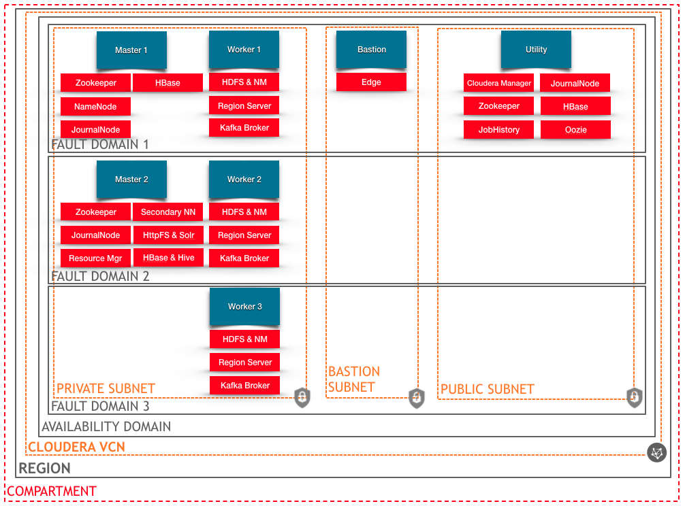

  
   
  <h1>Cloudera on Oracle Cloud Infrastructure</h1>
   

This is a Terraform module that deploys [Cloudera Data Platform (CDP) Data Center](https://www.cloudera.com/products/cloudera-data-platform.html) on [Oracle Cloud Infrastructure (OCI)](https://cloud.oracle.com/en_US/cloud-infrastructure).  It is developed jointly by Oracle and Cloudera.

## Deployment Information
The following table shows Recommended and Minimum supported OCI shapes for each cluster role:

|             | Worker Nodes   | Bastion Instance | Utility and Master Instances |
|-------------|----------------|------------------|------------------------------|
| Recommended | BM.DenseIO2.52 | VM.Standard2.4   | VM.Standard2.16              |
| Minimum     | VM.Standard2.8 | VM.Standard2.1   | VM.Standard2.8               |

## Resource Manager Deployment
This Quick Start uses [OCI Resource Manager](https://docs.cloud.oracle.com/iaas/Content/ResourceManager/Concepts/resourcemanager.htm) to make deployment quite easy.  

Simply click this button to deploy to OCI.

This template uses Terraform v0.12, and has support to target existing VCN/Subnets for cluster deployment.   To engage this functionality, just use the Schema menu system to select an existing VCN target, then select appropriate Subnets for each cluster host type.

If you deploy Cloudera Manager to a private subnet, you will require a VPN or SSH Tunnel through an edge node to access cluster management.

Once the deployment is complete you can access Cloudera manager at `http://<some IP address>:7180/cmf/login`.  

Cluster Provisioning is executed on the Utility host using CloudInit.   That activity is logged in /var/log/cloudera-OCI-initialize.log.   This log file can be used to triage cluster setup issues.

The default username is `cm_admin` and the default password is `changeme`.  You should see a cluster up and running like this:

If upon login you are presenetd with a licensing prompt, please wait, do not interact, and allow additional time for the automated cluster provisioning process to complete.   Refresh the page after a few minutes to check on deployment.

## Python Deployment using cm_client
The deployment script `deploy_on_oci.py` uses cm_client against Cloudera Manager API v31.  This script can be customized before execution.  Reference the header section in the script, the following parameters are passed at deployment time either manually or via ORM schema:

		admin_user_name
		admin_password

When using ORM schema, these values are put into Utility instance metadata.   It is highly encouraged to modify the admin password in Cloudera Manager after deployment is complete.

In addition, advanced customization of the cluster deployment can be done by modification of the following functions:

		setup_mgmt_rcg
		update_cluster_rcg_configuration

This requires some knowledge of Python and Cloudera configuration - modify at your own risk.  These functions contain Cloudera specific tuning parameters as well as host mapping for roles.

## Kerberos Secure Cluster Option

This automation supports using a local KDC deployed on the Cloudera Manager instance for secure cluster operation.  Please read the scripts [README](scripts/README.md) for information regarding how to set these parameters prior to deployment if desired.  This can be toggled during ORM stack setup using the schema.

Also - for cluster management using Kerberos, you will need to manually create at a minimum the HDFS Superuser Principal as [detailed here](https://www.cloudera.com/documentation/enterprise/latest/topics/cm_sg_using_cm_sec_config.html#create-hdfs-superuser) after deployment.

## High Availability

High Availability for HDFS services is also offered as part of the deployment process.  This can be toggled during ORM stack setup using the Schema.

## Metadata and MySQL

You can customize the default root password for MySQL by editing the source script [cms_mysql.sh](scripts/cms_mysql.sh#L188).  For the various Cloudera databases, random passwords are generated and used.  These are stored in a flat file on the Utility host for use at deployment time.  This file should be removed after you notate/change the pre-generated passwords, it is located here on the Utility node:  `/etc/mysql/mysql.pw`

## Object Storage Integration

Object Storage can also be leveraged by setting S3 compatability paramaters in the Python deployment script.   Details can be found in the [header section](https://github.com/oracle-quickstart/oci-cloudera/blob/8af97b91fb50cd77262c97580454137c2955dd4e/scripts/deploy_on_oci.py#L79-L86).  You will need to setup the appropriate S3 compatability pre-requisites as [detailed here](https://docs.cloud.oracle.com/iaas/Content/Identity/Tasks/managingcredentials.htm#Working2) for this to work.

## Architecture Diagram
Here is a diagram showing what is typically deployed using this template.   Note that resources are automatically distributed among Fault Domains in an Availability Domain to ensure fault tolerance.   Additional workers deployed will stripe between the 3 fault domains in sequence starting with the Fault Domain 1 and incrementing sequentially.

